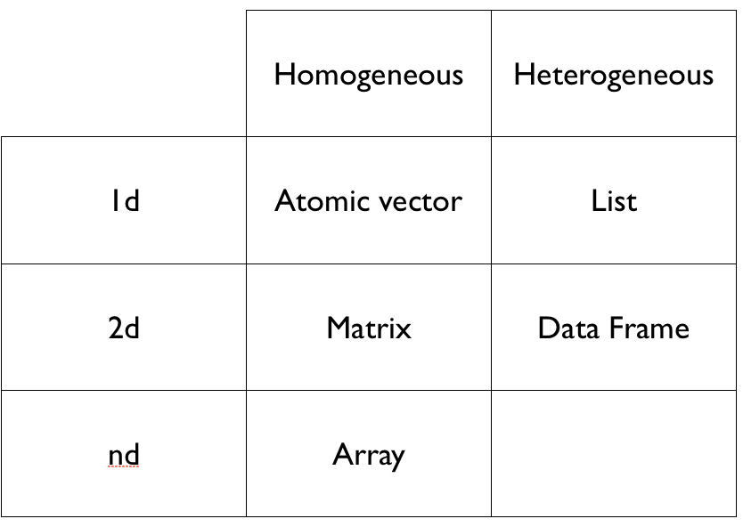

# Data structures in R



## Vectors

A vector is the basic data structure. Comes in two forms: 

* Atomic vectors
* Lists

Each vector has the following properties:

```coffee
typeof()
length()
attributes()
```

Atomic vectors

logical, integer, double (numeric), character

```coffee
# A logical vector

x <- c(TRUE, FALSE, TRUE, FALSE, TRUE, FALSE, TRUE, FALSE)
length(x)
x_num <- c(1, 3, 4,6, 14)
x_integers <- c(1L, 3L, 4L, 6L, 14L)
character <- c("This is a string", "This is another string")
```


## Lists

Lists are different from atomic vectors in that they can contain any other type of vector, including lists. You construct them using of .

