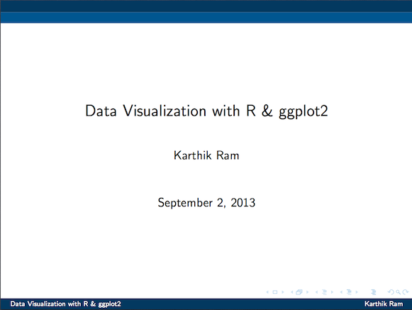

# Introduction to `ggplot2`

One of the most powerful features of R is its ability to generate very high quality publication quality figures programmatically. Once you have generated and perfected a figure, it becomes really simple to reuse that code over and over with the need to deal with GUI menus.

[](https://github.com/ropensci/norwich-2013-09/blob/master/ggplot.pdf?raw=true)

---

You might notice that the PDF I used for this section was generated programmatically. I did not manually run code, copy and insert figures into a Word doc that I then converted to a PDF. R took care of all the steps. To generate the pdf presentation locally:

```coffee
library(knitr)
knitr('ggplot.Rnw')  
system("pdflatex ggplot.tex")
```

*Important note: If you don't have `LaTeX` already installed on your machine, you'll have trouble with this step.*

* [R code from the deck](https://github.com/karthikram/ggplot-lecture/blob/master/ggplot.R)

## Suggested readings
* [Elegant graphics for data analysis](http://www.amazon.com/ggplot2-Elegant-Graphics-Data-Analysis/dp/0387981403/)   
*  [R Graphics Cookbook](http://www.amazon.com/R-Graphics-Cookbook-Winston-Chang/dp/1449316956)
