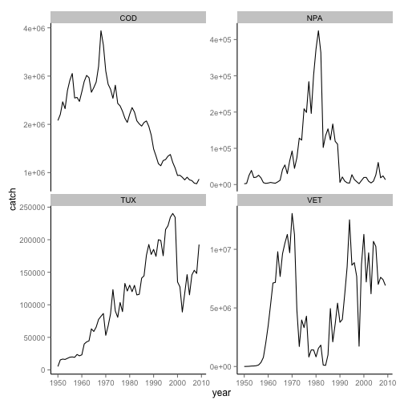

```r
library(rfisheries)
```

```
## Loading required package: RCurl Loading required package: bitops Loading
## required package: RJSONIO
```

```r
library(reshape2)
library(ggplot2)
```


```r
species <- species_codes(progress = "none")
tunas <- grep("Tuna", species$english_name)
```


```r
who <- c("TUX", "COD", "VET", "NPA")
by_species <- lapply(who, function(x) landings(species = x))
names(by_species) <- who
```


```r
dat <- melt(by_species, id = c("catch", "year"))
names(dat) <- c("catch", "year", "a3_code")
```


Tidy data is easy to plot:


```r
ggplot(dat, aes(year, catch)) + geom_line() + facet_wrap(~a3_code, scales = "free_y")
```

 


```r
library(data.table)
species <- data.table(species)
setkey(species, "a3_code")
code_names <- species[who, scientific_name]
```


```r
code_names[[2]] <- factor(code_names[[2]])
```


or as a named string,


```r
codes <- code_names$scientific_name
names(codes) <- code_names$a3_code
codes
```

```
##               TUX               COD               VET               NPA 
##       Scombroidei      Gadus morhua Engraulis ringens  Engraulis mordax 
## Levels: Engraulis mordax Engraulis ringens Gadus morhua Scombroidei
```


Perhaps we want date formats


```r
# dat[[2]] <- as.POSIXlt.character(dat[[2]], format = '%Y')
```


```r
col_meta <- c(catch = "Global Landings of fish", year = "year", a3_code = "3 digit country code")
unit_meta <- list(catch = "tonnes", year = "YYYY", a3_code = codes)
```


```r
require(reml)
```

```
## Loading required package: reml
```

```r
eml$set(contact_givenName = "Carl", contact_surName = "Boettiger", contact_email = "cboettig@ropensci.org")
```

```
## Error: object 'eml' not found
```

```r
file_description <- "Landings data for several species by year, from the OpenFisheries database"
eml_write(dat = dat, col_meta, unit_meta, .title = "Landings Data", file = "landings.xml", 
    file_description = file_description)
```

```
## Error: unused arguments (.title = "Landings Data", file_description =
## file_description)
```


## Publish to rfigshare


```r
eml_publish("landings.xml", description = file_description, categories = "Ecology", 
    tags = "fisheries", destination = "figshare")
```

```
## Loading required package: rfigshare
```

```
## Error: XML content does not seem to be XML, nor to identify a file name
## 'landings.xml'
```


## Adding Location context with GBIF


```r
library(rgbif)
omany <- failwith(NULL, occurrencelist_many)
locations <- llply(as.list(code_names$scientific_name), omany, .progress = "none")
names(locations) <- who
species_loc <- lapply(locations, function(x) data.frame(species = x[1], Lat = x[3], 
    Long = x[4]))
loc <- melt(species_loc, id = names(species_loc[[1]]))
names(loc) <- c("scientific_name", "Lat", "Long", "a3_code")
a <- join(dat, loc, by = "a3_code")
```


Richer GBIF record ...


```r
omany <- failwith(NULL, occurrencelist)
locations <- llply(as.list(code_names$scientific_name), omany, format = "darwin", 
    .progress = "none")
gbif_dat <- lapply(locations, gbifdata, minimal = FALSE)
```


